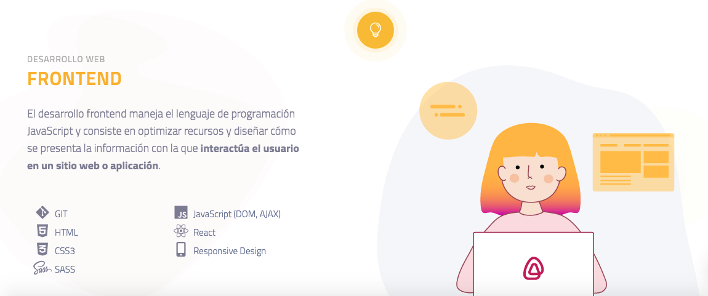
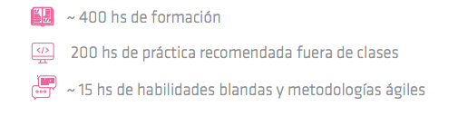

## Curso de Desarrollo Web Frontend en Ada ITW 👩‍💻✨

En este repositorio se encuentran mis apuntes y ejercicios de practica del curso de Desarrollo Web Frontend en Ada ITW que realicé recientemente.

### Temas abordados en el curso:

- HTML5
- CSS3
- Sass
- Responsive design
- GIT
- JavaScript (Vanilla JS, ES6, DOM, AXIOS)
- React JS
- Testing (JEST)

### Metodología:

### Más información:

\*https://adaitw.org/

\*https://adaitw.org/wp-content/uploads/2020/09/Carreras-Ada-2020.pdf
